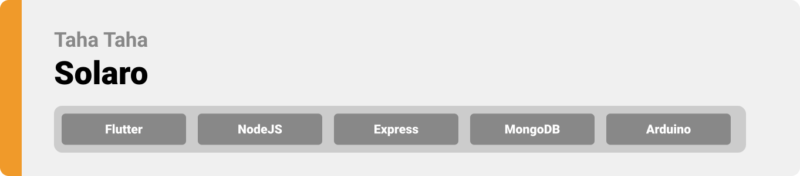
<br>


<br>

> Hello world! This is the project’s summary that describes the project as plain, simple, and limited to the space available.

<br>

- [PROJECT PHILOSOPHY](#project-philosophy)
- [USER TYPES](#user-types)
- [Key Features of the App](#features)
- [TECH STACK](#tech-stack)
- [PROTOTYPING](#prototyping)
- [Demo](#implementation)
  - [App](#implementation)
  - [IoT System](#iot)
  - [Advertising Website](#website)
- [Performance](#performance) 
- [How to Run](#how-to-run)
  - [Prerequisites](#prerequisites)
  - [Installation](#installation)
  - [Hardware](#hardware)


<br>

<!-- project philosophy -->


> "Fatal Breath" - Your Safety Guardian

>"Fatal Breath" is an IOT revolutionary application designed to safeguard lives by monitoring and controlling indoor air quality in real time. Our mission is to protect you and your loved ones from the silent threat of toxic gases in your living spaces, like carbon monoxide (CO).

>With "Fatal Breath," you can ensure a safe environment by easily monitoring gas levels, receiving timely alerts, and taking immediate action when needed. Breathe easy and live with confidence, knowing that "Fatal Breath" has your back.

<br>

<a name="features" id="features"></a>
### Key Features
- **Real-Time Monitoring:** Keep an eye on gas levels, ensuring a safe living environment for you and your family.
- **Instant Alerts:** Receive notifications when gas levels exceed safe limits, allowing you to take immediate action.
- **Secure Communication:** Stay connected with your household members through our in-house chat feature.

<br> 

<a name="user-types" id="user-types"></a>
### User Types 

1. Manager 
2. General Users

<br>

### User Stories
- As a user, I want to monitor the CO level in the rooms, so I can know the room status.
- As a user, I want to log in and edit my profile, so I can enter the app and change my info.
- As a user, I want to request to enter a house and accept invitations, so I can be a member of a house.
- As a user, I want to chat with other users in the same house, so I can check on them if something happens.
- As a user, I want to receive notifications about the CO level, so I can stay aware of the current status.

<br/>

### Manager Stories
- As a manager, I want to add or delete my houses and rooms, so I can monitor all my houses at the same time.
- As a manager, I want to invite users to enter my house and accept requests, so I can add members to my house.

<br><br>

<!-- Tech stack -->


###  Fatal Breath is built using the following technologies:

- **Frontend Development:** <br> The Fatal Breath app is built using [Flutter app development framework](https://flutter.dev/). Flutter enables the development of cross-platform mobile applications with a single codebase, allowing them to run seamlessly on various devices, including mobile, desktop, and web.

- **Backend Development:** <br> For the backend, [Laravel](https://laravel.com) is used. Laravel is a robust PHP framework known for its elegant syntax and powerful features, making it ideal for building efficient and secure server-side applications.

- **Database Management:** <br> The application relies on MySQL for database management. MySQL is a widely used open-source relational database management system that ensures data is stored and retrieved efficiently.

- **Real-time Chat:** <br> To facilitate real-time communication among users, Firebase Realtime Database is integrated. [Firebase](https://firebase.google.com) is a Google-backed platform that offers real-time database capabilities, making it perfect for features like live chatting within the app.

- **Notifications:** <br> Firebase Cloud Messaging (FCM) is used for sending push notifications to users. FCM is a cross-platform messaging solution that ensures reliable message delivery across different devices.

- **Advertising Website:** <br> The advertising website for the Fatal Breath app is developed using [Next.js](https://nextjs.org), a popular React framework for building fast and SEO-friendly web applications. [TypeScript](https://www.typescriptlang.org) is used to enhance the website's development, providing static typing and better tooling support.

- **User Interface:** <br> The app's user interface adheres to a responsive and modern design using [Tailwind CSS](https://tailwindcss.com). Tailwind CSS is a utility-first CSS framework that simplifies the styling process while maintaining a highly customizable design.

- **Hardware Integration:** <br> Fatal Breath includes hardware integration with an [ESP8266 microchip](https://www.espressif.com/en/products/socs/esp8266) connected to an MQ2 sensor. This setup enables the monitoring of CO levels within rooms and provides real-time data to the app.

- **Font:** <br> The primary font used in the app is ["Poppins"](https://fonts.google.com/specimen/Poppins), known for its readability and versatility.

<br><br>

<!-- Prototyping -->
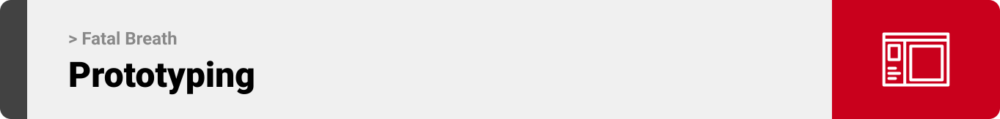

> We designed Fatal Breath using wireframes and mockups, iterating on the design until we reached the ideal layout for easy navigation and a seamless user experience.

<br>

### Wireframes
| Sign Up screen  | Home screen |  Chat screen |
| ---| ---| ---|
|  | 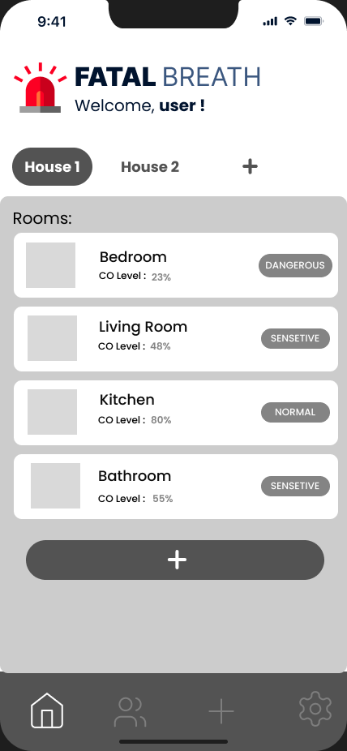 | 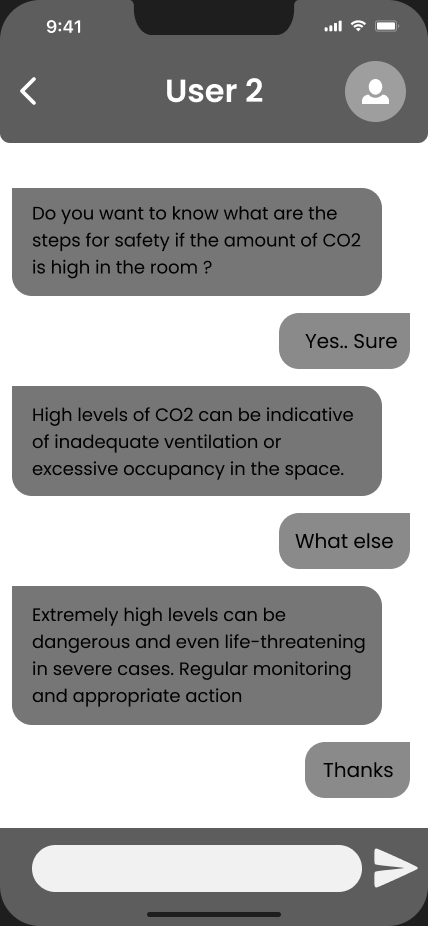 |

<br>


### Mockups
| Sign Up screen  | Main Screen | Chat Screen |
| ---| ---| ---|
| 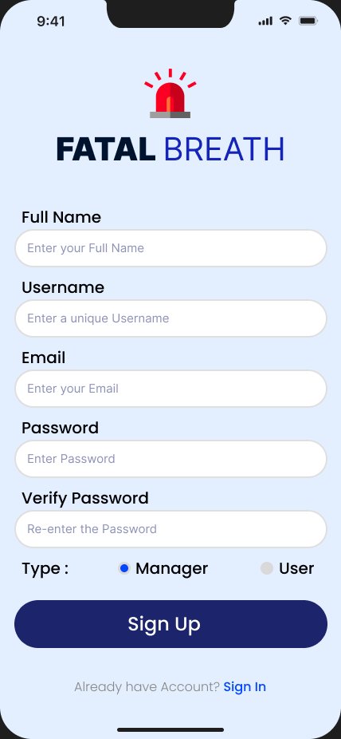 | 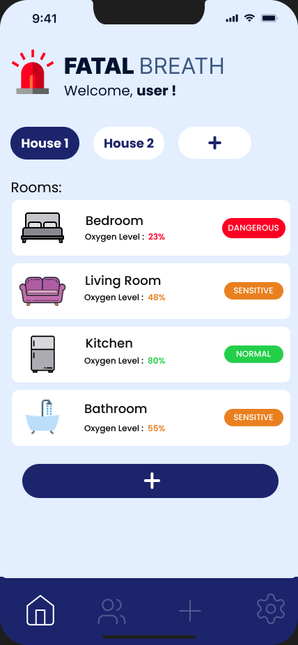 | 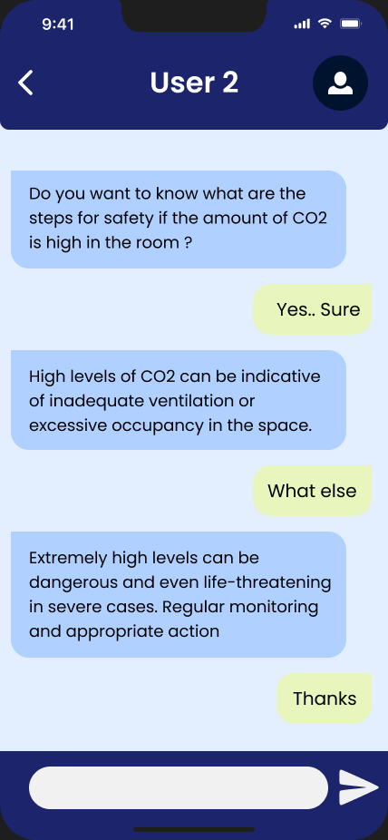 |
| Register screens  | Home Screens | Users Screens |
| 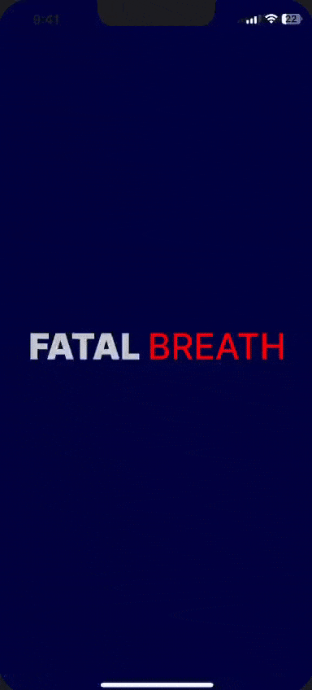 | 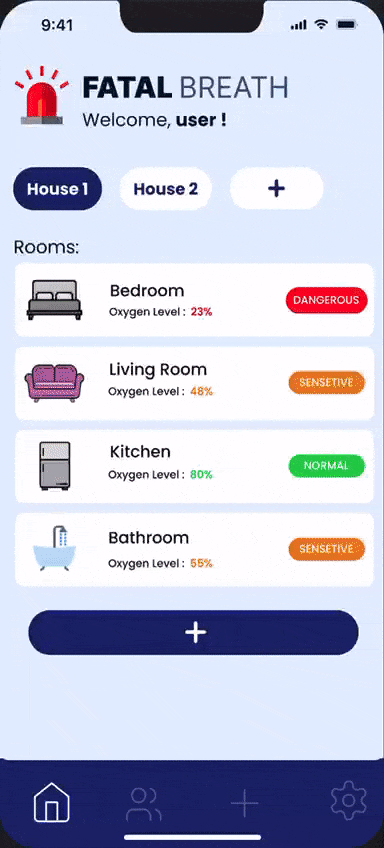 | 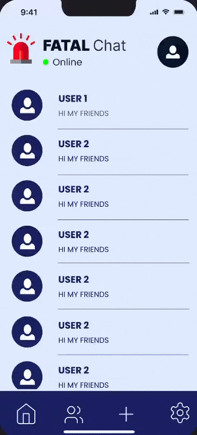 |

<br><br>

<!-- Implementation -->
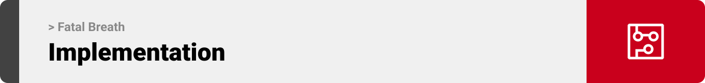

> Using the wireframes and mockups as a guide, we implemented the Fatal Breath app with the following features:

### Common Screens (Mobile)
| Sign Up | Sign In | Edit Profile |
| ---| ---| ---|
| 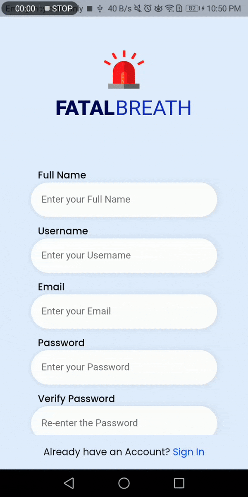 | 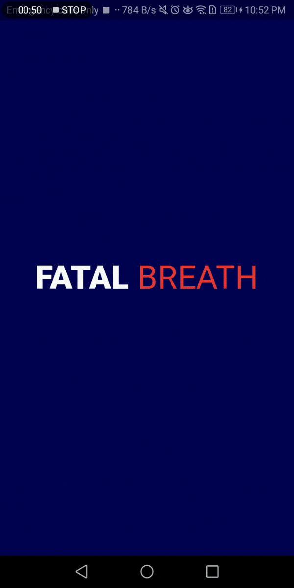 |  |

<br>

| Chatting-System |Notification| Change-Password | 
| ---| ---| ---|
|  |  | 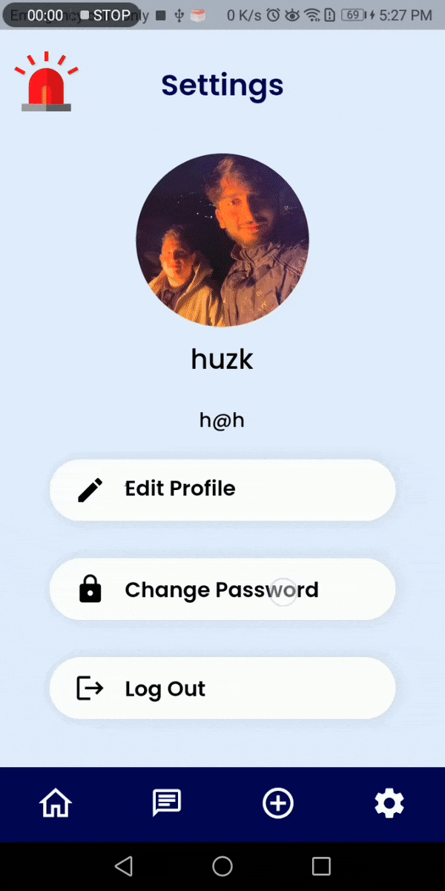 |

<br><br>

### Member Screens
| Monitor CO Level | Manage Houses | Search for Houses | 
| ---| ---| ---|
|  | 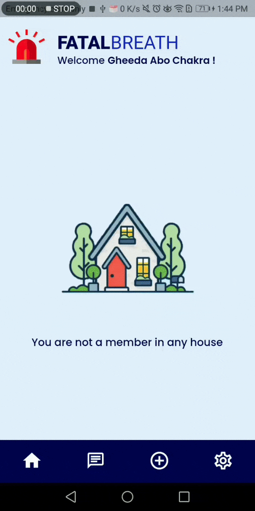 | 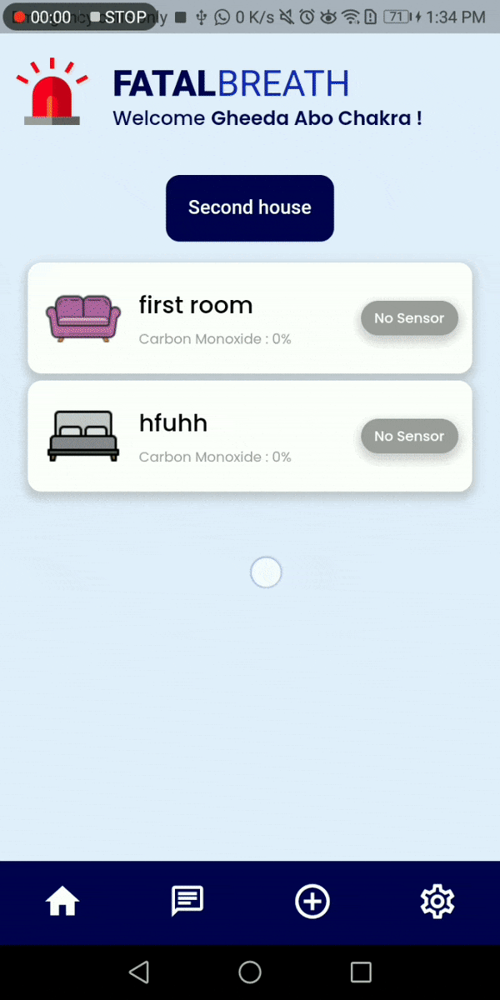 |

<br><br>

### Manager Screens
| Edit Houses  | Monitor Rooms | Search for Members | 
| ---| ---| ---|
| 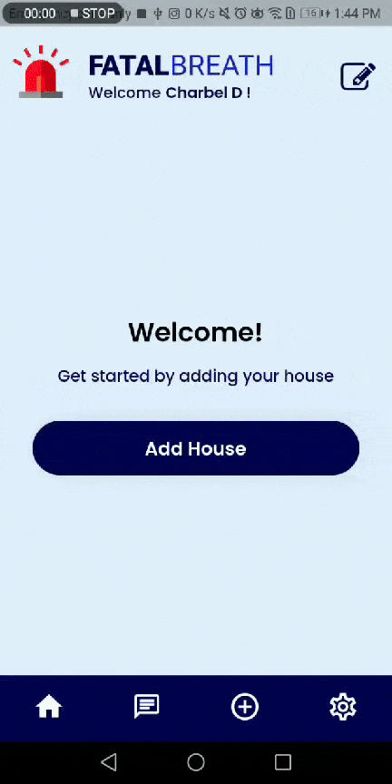 |  |  |

<br><br>

### IoT System
<div align="center" name="iot">

| Hardware | Circuit |
| ---| ---|
|  |  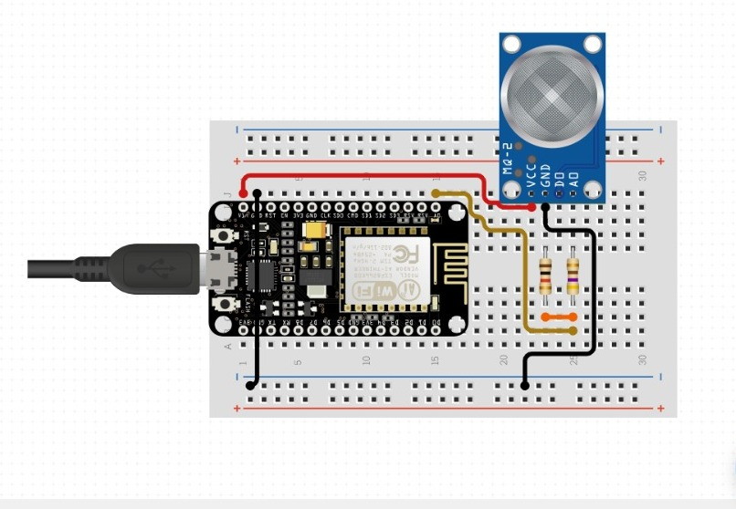 |
</div>
<br><be>

### Advertising Website

Visit the [application advertising website](https://fatal-breath.vercel.app) to learn more about the application's features and benefits.

<div align="center" name="website">

| Website Preview | 
| ---|
| 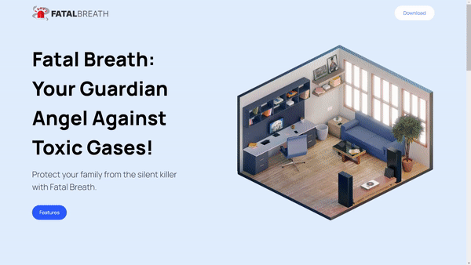 |

</div>

<br><br>


>The application is designed to be highly scalable and can effortlessly accommodate a substantial number of users and records. It has been engineered to manage large user volumes and high demand, allowing you to concentrate on your core activities with confidence.

<br>

| Users Table | Live Testing |
| ---| ---|
| 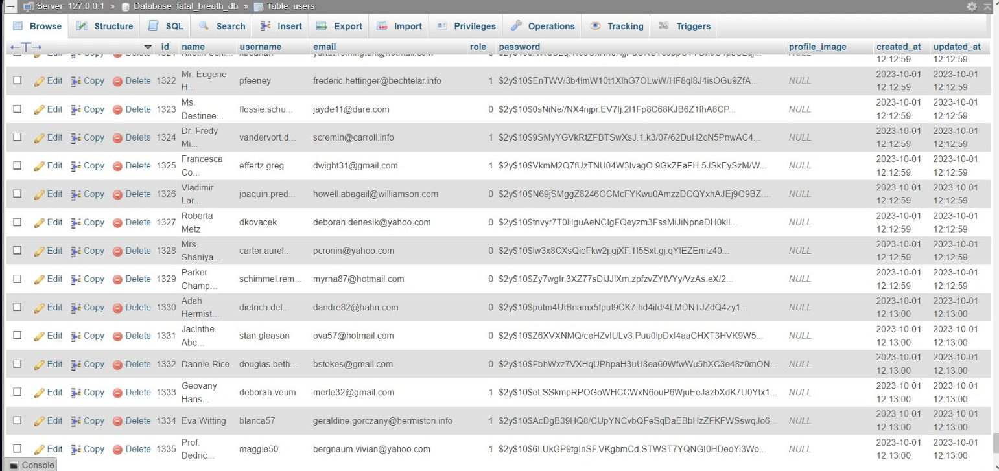 |  |


<br><br>


<!-- How to run -->


> To set up Fatal Breath locally, follow these steps:

<a name="prerequisites"></a>

### Prerequisites

- Flutter SDK: Install the Flutter SDK to build and run the mobile application.

- Arduino IDE: You'll need the Arduino IDE to upload code to the ESP8266 microchip.

- ESP8266 (Hardware): Ensure you have the ESP8266 microchip connected to an MQ2 sensor for monitoring CO levels.

<a name="installation"></a>

### Installation

_Below is an example of how you can instruct your audience on installing and setting up your app. This template doesn't rely on any external dependencies or services._

1. Clone the repo

    ```sh
    git clone https://github.com/Hu-zk/Fatal-Breath.git
    ```

2. Install Laravel dependencies by navigating to the Laravel project directory:

   ```sh
   cd laravel-backend
   composer install
   ```

3. Set up your Laravel environment and configure the .env file with your database settings.

   Run Laravel migrations to set up the database:

   ```sh
   php artisan migrate
   ```

4. Navigate to the Flutter app directory:

   ```sh
   Navigate to the Flutter app directory:
   ```

5. Install Flutter dependencies and run the Flutter app on your emulator or connected device:

   ```sh
   flutter pub get
   flutter run
   ```
<a name="hardware"></a>

### Hardware Setup (Go to the simulation section to simulate hardware functionality)

-  ESP8266 Hardware Setup:

1. Plug your Arduino to your laptop/mac

2. Install [Arduino IDE](https://docs.arduino.cc/software/ide-v2/tutorials/getting-started/ide-v2-downloading-and-installing)(You can use alternative Arduino IDE's)

3. Upload the Arduino code located in the esp8266 directory to your ESP8266 microchip using the Arduino IDE.

4. Connect the ESP8266 to the MQ2 sensor and other required components as per your hardware configuration.

<br>

Now, you should be able to run **Fatal Breath** locally and explore its features
